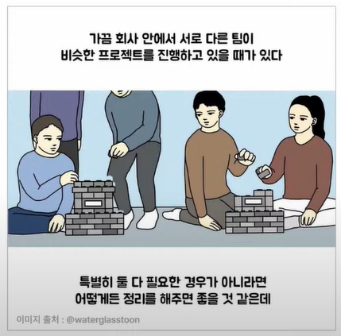
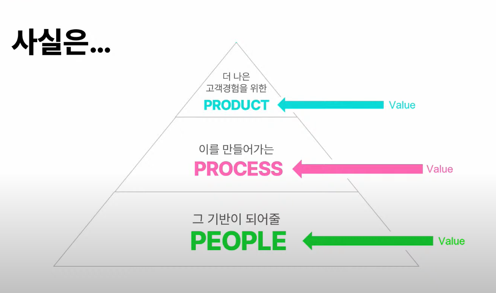
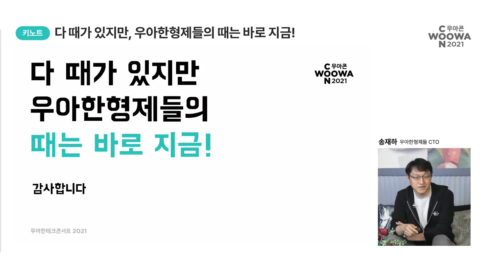

# 다 때가 있지만, 우아한 형제들의 때는 바로 지금!
> 송재하, 우아한 형제들 CTO

## 지금까지의 배민은

> 좋은 음식을 먹고 싶은 곳에서 먹을 수 있도록, 언제나 놀라운 경험을 배달할 수 있도록 최선을 다해 달려왔습니다.
> 
> 그 결과 **한 달 주문 수 1억** 이라는 놀라운 결과를 이루어냈습니다.

- 배달산업이 책임지는 한 달 끼니 수

  한 달 주문 수 1억 x 주문당 2.5인분 x 1.43 = 3.6억 끼

- 우리나라 사람들의 한 달 끼니 수

  삼시 3끼 x 5천만 명 x 30일 = 45억 끼

> 당장 국내만 하더라도, 배달산업의 성장 가능성은 높습니다.
>
> 인구가 1억에 육박하는 배트남 같은 세계 시장까지 합하면
>
> 아직 배달산업은 **무한한 가능성**을 가지고 있는 거죠.

```
💡 "1.43" 의 의미
배달의민족은 국내 배달산업의 70%를 차지하고 있습니다.
이를 통해 배달의 민족이 책임지는 한 달 끼니 수로 총 국내 배달산업이 책임지는 한 달 끼니 수를 역산하기 위해 10/7(1.43)을 곱한 거죠.
```

## 그리고 지금이 배민이 가장 재밌어질 때

### 배민이 우아해지기 위해 극복해야 했던 것들

> 배민은 지금 **거대한 시장을 공략할 고민을 하는 때!**
>
> 하지만 이렇게 **폭풍 성장** 하는 배민에게 닥쳐온 문제가 있었습니다!

- 배달산업의 특징

  배달산업은 `거대한 트래픽` 과 `극단적인 쏠림현상`이 자주 일어나는 산업입니다.

  특히 실시간으로 처리돼야 하는 트래픽들이 많죠

- 아직 많이 남아있는 파이

  전술했듯, 아직 배달산업은 무한한 성장 가능성을 가지고 있습니다. 

  즉 더욱더 성장할 기회가 있다는 것이죠

- 배민의 서비스 확장

  배달에서 테이크아웃으로, 그리고 외식으로 배민은 

  그저 배달만 하는 것이 아닌 그 속의 가치를 창조하기 위해 계속해서 서비스를 확장하고 있습니다!

  _ex. B마트, 만화경, 배민 상회 등..._

> 이러한 상황에서 배민의 프로젝트, 팀 구조는 점점 **사일로** 해졌습니다.


```
💡 사일로 효과란? 
곡식이나 사료를 저장하는 굴뚝 모양의 창고 "사일로"에서 고안된 단어로,
조직부서 간에 서로 협력하지 않고 내부 이익만을 추구하는 현상을 의미합니다.
즉, 조직 내에서 개별부서끼리 서로 담을 쌓고 각자의 이익에만 몰두하는 부서 이기주의를 말하죠.
```

### 배민이 우아하게 문제를 해결해나가는 방법

> 그렇다면 이러한 문제 속에서 배민은 어떻게 성장해나갔을까요?

- 더 나은 고객 경험을 위한 **PRODUCT**

  > 배달산업이 성장하는 만큼 배민도 성장해버리자!

  우아한 형제들은 전 국민이 매일매일 사용하는 배달의 민족부터

  퀵 커머스의 선두 주자 B마트

  라이브 커머스 플랫폼인 배민 쇼핑 Live 

  등의 실시간 서비스를 만들어 나가고 있고, 그에 대한 접점을 만들어 나가고 있습니다

  또한 `만다오` 같은 플랫폼을 개발하여 더욱 쉽게 프로덕트를 손볼 수 있도록 하였습니다 _(3일 차 세션에서 자세히 다룰 예정!)_ 

- 이를 만들어가는 **PROCESS**

  > 사일로 해지는 팀들을 모아줄 단 하나의 프로세스

  프로덕트가 고도화되고, 조직규모가 확장되면서 

  그에 따른 일하는 방식, **프로세스** 가 필요해졌습니다

  

  어떤 사업이든, 빠르게 성장하고 크게 성장할수록 사업이 확장되고, 

  프로덕트가 확장되는 사업의 속도를 따라가지 못하기에 기술 부채가 생깁니다.

  이러한 부채를 해결하기 위해, 지속해서 업무 프로세스를 개선해야 합니다

  

  > 배민이 프로세스를 개선하는 우아한 방법

  - 한정된 자원을 효율적으로 배분하고 활용하기

  - 프로세스가 없는 배포 프로세스

    모든 개발자가 **아무런 부담 없이 배포** 를 할 수 있는 환경을 구축하는 것을 목표로 나아가는 중!

  - 안정적으로 운영하기

    장애 대응 프로세스로 더욱 안정적인 서비스 구축하기!
    (저희는 모의 장애 훈련에 진심입니다. 세션 참고하기!)

- 그 기반이 되어줄 **PEOPLE**

  > ~~뭣이 중헌디? 사람!~~

  > 회사의 성장은 개인의 성장이 될 수 없습니다. 
  >
  > 그렇다면 개인의 성장을 통해 회사가 성장한다면 어떨까요?

  개발자의 성장이 회사의 성장으로 나아갈 수 있도록, 다양한 지원을 하고 있습니다!

  **Support**

  - 대외활동 장려 및 지원
  - 교육지원
  - 직군별 meet up 지원

  **Transparency**

  - 개발자 타운홀
  - 우아한 테크토크
  - 직군별 개발그룹
  - 시스템 이슈 회의 (장애 리뷰)

### 사실 이 세 축은 축이 아니라 레이어다!




## 우아한 형제들의 때는 어떤 때?

> 우아한 형제들은 `골디락스`입니다!
>
> 이미 정착된 닦여진 길도, 전혀 닦여있지 않은 비포장도로도 아닌
>
> **뜨겁지도 차갑지도 않은, 먹고 마시고 즐기고 도전하기 좋은 온도!**

